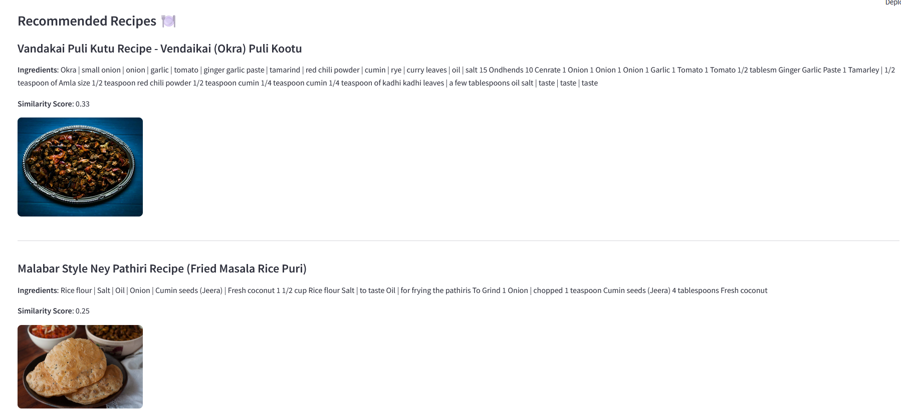

# 🍽️ Recipe Recommender System

This project recommends recipes based on a user’s input using Python, TF-IDF, and Cosine Similarity from NLP.
## 🖼️ App Preview

## 🚀 Features
- Recommend recipes similar to user input
- Works with Indian, Healthy, and Indonesian recipes
- Built with Python and Pandas
- Uses TF-IDF Vectorizer + Cosine Similarity

## 🧠 How it works
- Dataset is cleaned and converted into vectors
- User enters a recipe name or ingredient
- Code finds the most similar recipes using cosine similarity

## 📂 Project Structure
- Food_Recipe.csv, IndianHealthyRecipe.csv, etc. – your datasets
- recommender.py – the script that recommends recipes
- README.md – this file

## 📦 Run it locally
1. Clone the repository:
   git clone https://github.com/Shivanee11/RecipeRecommender.git

2. Go to the project folder:
   cd RecipeRecommender

3. Install required packages:
   pip install -r requirements.txt

4. Run the recommender script:
   python recommender.py

## 👩‍💻 Author
Shivanee Rao – B.Tech at KIIT | Frontend Developer  
GitHub: https://github.com/Shivanee11
